# SpaceReloaded

[](https://github.com/AlexMelanFromRingo/SpaceReloaded/actions/workflows/build.yml)


[](LICENSE)
[](https://alexmelanfromringo.github.io/SpaceReloaded/recipes.html)

Space exploration for Minecraft 26.2 built around one rule: **the physics are
real**. Rockets are entities assembled from blocks you placed yourself.
Delta-v comes from the Tsiolkovsky equation, thrust-to-weight is computed from
actual part masses, and a lopsided rocket tips over on ascent.

It takes the best of four classic mods and Kerbal Space Program and rebuilds it on real physics: colonies
and stations from **Galacticraft**, free-form rockets and satellites from
**Advanced Rocketry**, visible machines and deep crafting chains from
**Create**, industrial multiblocks from **Immersive Engineering**.

[Документация на русском](README.ru.md)

<p align="center">
  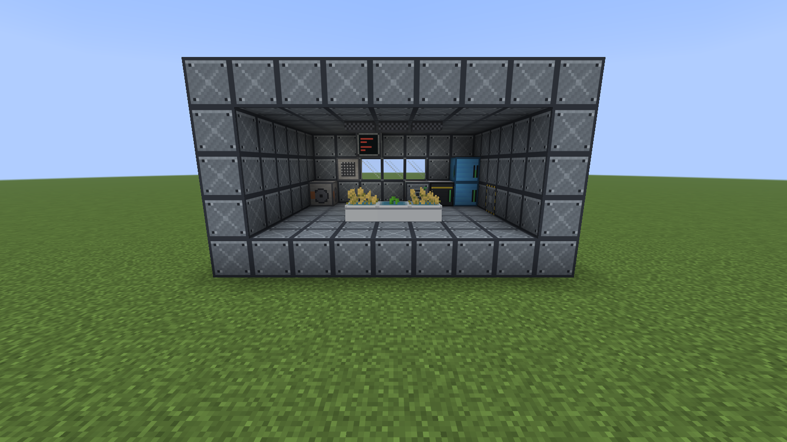
</p>
<p align="center">
  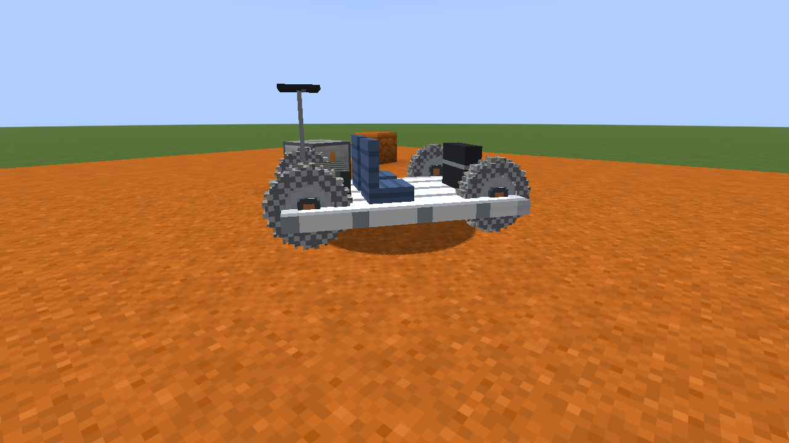
  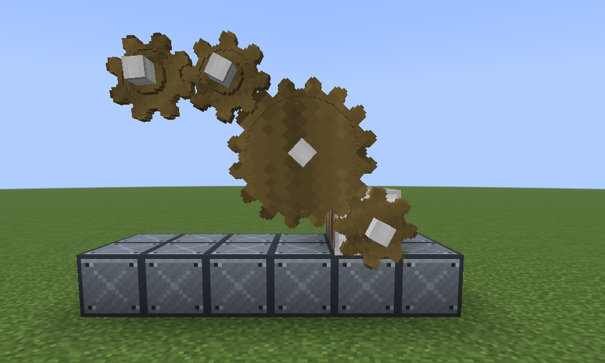
</p>
<p align="center">
  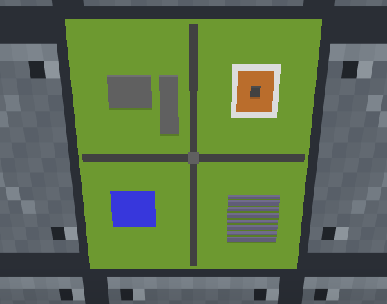
  
</p>
<p align="center">
  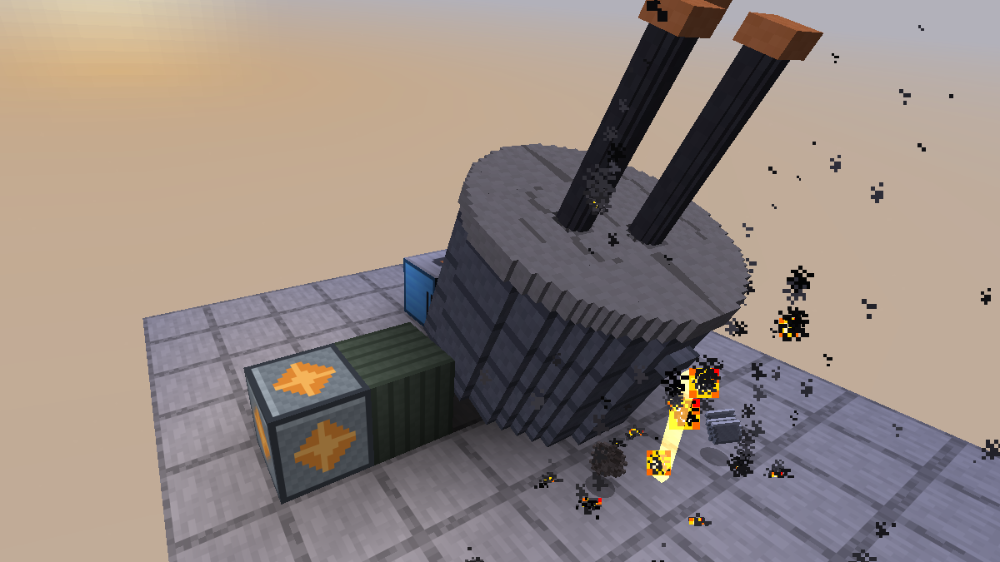
  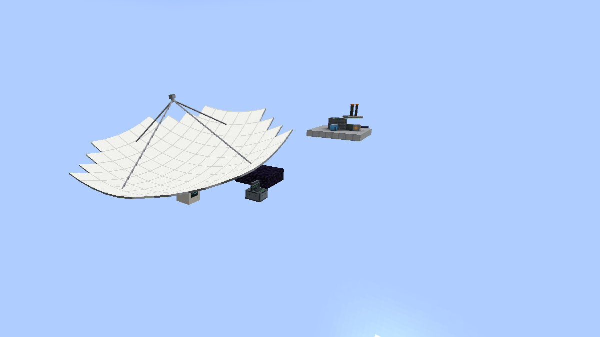
</p>
<p align="center">
  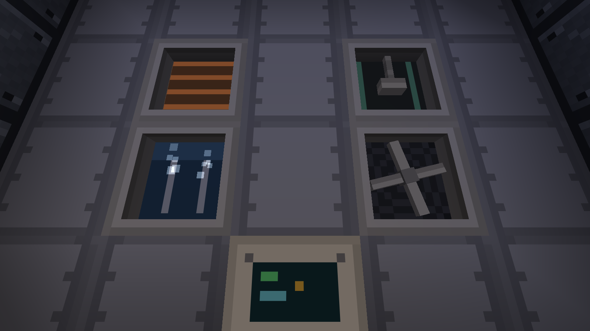
  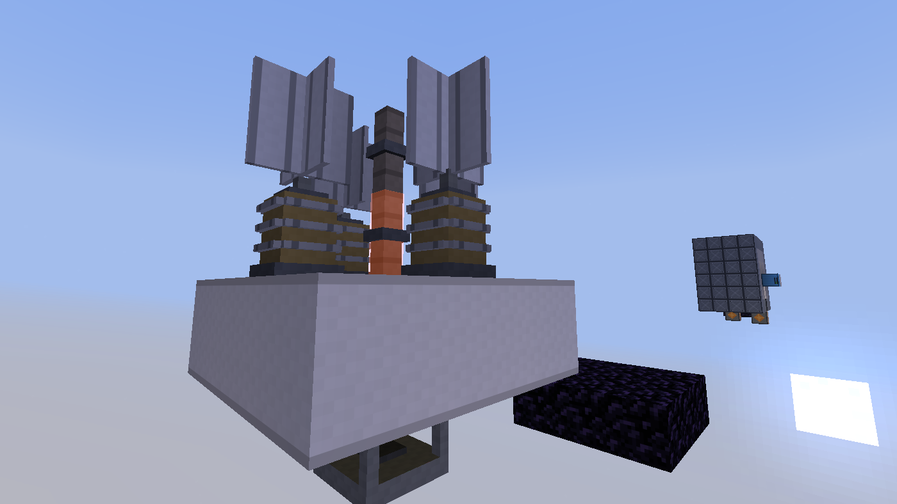
</p>
<p align="center">
  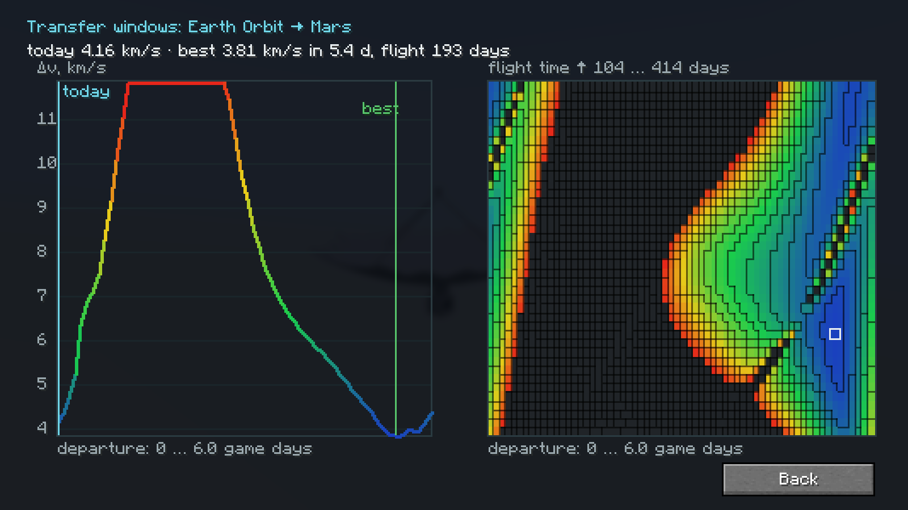
  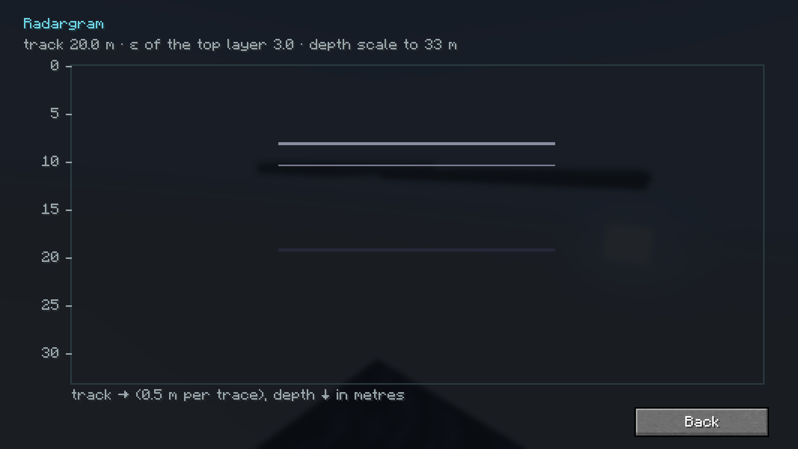
</p>
<p align="center">
  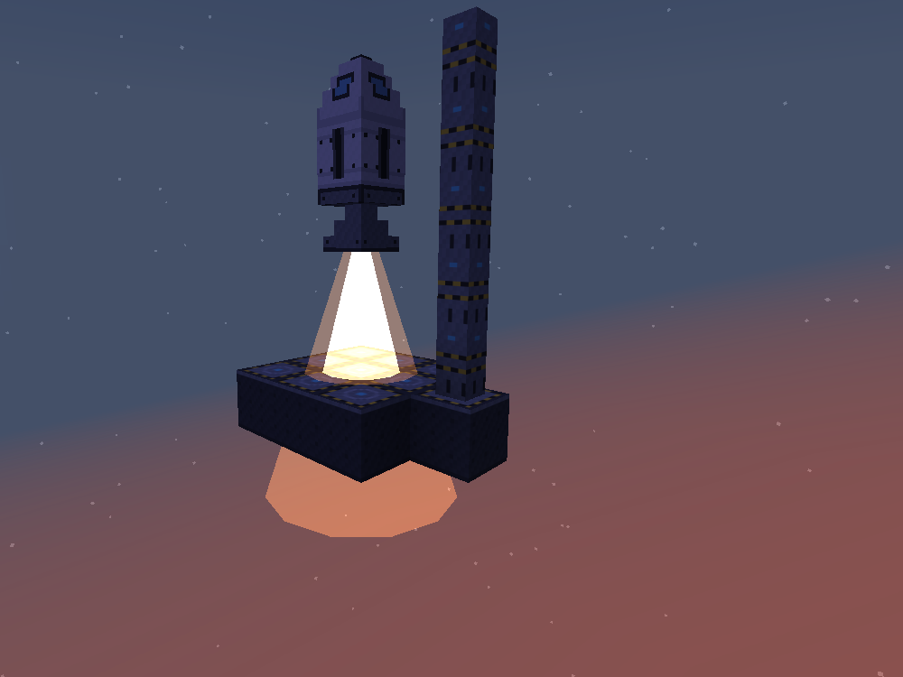
  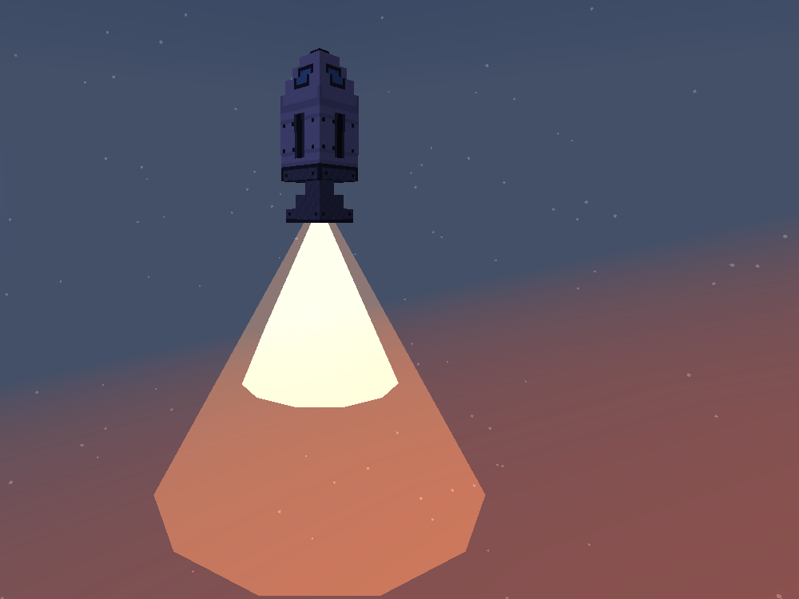
</p>

<p align="center">
  <b><a href="https://alexmelanfromringo.github.io/SpaceReloaded/recipes.html">Recipe book</a></b>: every recipe rendered as cards, from crushing to the assembly table.
</p>

## What it does

- **Free-form rockets.** Build any shape on a launch pad, sneak-click the
  assembly pylon and the structure lifts off as a single entity. Mass, thrust,
  center of mass and torque come from the real blocks. TWR below 1 stays on
  the pad. Fuel is drawn from the actual tank blocks you filled. A plain
  click gives you a scan report first: delta-v, TWR and a verdict on whether
  the stack reaches orbit.
- **Multi-stage rockets.** A stage separator block splits the stack into
  stages. The scan report gives delta-v per stage from sequential Tsiolkovsky
  terms (upper stages ride as dead mass), only the active stage burns, and a
  key press or the autopilot drops the spent stage. The dropped stage is a
  real object: it falls, crashes with E = ½mv², or survives a soft touchdown
  as a reusable booster.
- **Attitude control and gravity turns.** WASD tilts the rocket toward where
  the pilot looks, up to 45 degrees, and the gyroscope's PD loop follows the
  command. Tilted thrust buys horizontal speed, so spent stages fall
  downrange instead of onto the pad. No gyroscope, no control.
- **Atmospheres that push back.** Earth and Mars carry an exponential density
  profile. Quadratic drag acts on rockets, tungsten rods and meteors alike,
  a coasting rocket settles at terminal velocity, and entry heating follows
  Sutton-Graves: without a return capsule in the stack the crew burns. The
  scan report replaces the sqrt(2gh) guess with a numerical ascent simulation
  that reports the real delta-v cost and peak dynamic pressure.
- **Three propellants with different characters.** Kerolox (dense, high thrust)
  is refined from oil shale; hydrolox (high specific impulse) is electrolyzed
  from ice; methalox is made on Mars from atmospheric CO2. Engines burn one
  type, so a mixed stack won't assemble. Each propellant is a real fluid with
  its own bucket and its own density, exposed to other mods through the Fabric
  Transfer API.
- **Hermetic sealing that takes geometry seriously.** Room checking is a
  26-direction flood fill: a diagonal corner gap counts as a leak, exactly
  like an incomplete portal frame. Airlocks interlock. A breach causes
  decompression that drags you toward the hole.
- **Earth orbit and the Moon.** Coordinate-scaled dimensions (1:8), an orbital
  platform per launch site, ISRU refueling on the Moon: ice becomes hydrolox
  plus oxygen for your canisters.
- **Docking.** A docking clamp block marks the separation plane. Undock a
  parked stack into carrier and lander, fly the lander down, refuel, return
  and dock again. Capture works within a 3-block radius, no pixel-perfect
  parking. Propellant splits and merges by real tank capacity.
- **Unmanned flights.** Write a flight program (destination plus landing
  beacon), upload it to a parked rocket, trigger the launch remotely. The
  autopilot climbs, transfers and lands on the beacon with a terminal
  retro-burn.
- **Honest transfer costs.** Every body carries a table of transfer delta-v
  derived from Hohmann and patched-conic equations on real orbits (Moon 3955,
  Mars 3613 m/s). At transition altitude the server burns that budget through
  the stages by Tsiolkovsky; a stack that cannot afford it does not transfer
  and the pilot is told need versus have. The HUD shows the price of the next
  hop, and every unmanned launch runs a full route planner (numerical ascent,
  transfer, propulsive landing with TWR at the destination) and refuses with
  numbers instead of wasting propellant.
- **Cargo lines.** A cargo terminal next to a landing beacon holds a flight
  program and, in AUTO mode, dispatches any unmanned parked craft once loaders
  and pumps have gone quiet, after checking budget, transfer window and
  satellite coverage. A terminal on the far end sends it back. Mid-route the
  autopilot relaunches itself from the orbital platform. Status lives in the
  terminal, in Jade and in Mission Control.
- **Wet workshop.** A docking port is a hatch with a purpose: sneak-click it
  and the empty stage parked at its face becomes a station module made of
  blocks. Exposed tanks and hull turn into module hull, enclosed ones into
  habitable volume, engines and the command module stay, the wall facing the
  port becomes a hatch. Residual propellant is vented, cargo is dropped, and
  the shell passes the regular 26-direction sealing check.
- **Lunar industry.** On an airless body you do not burn propellant to lift
  ore: an electromagnetic mass driver does it with electricity. Lay a straight
  line of coil sections from the breech; muzzle velocity is v = sqrt(2 sum
  a_i L_i), so reaching Earth orbit from the Moon (2515 m/s) takes 108
  superconducting or 323 steel sections. The shot draws E = ½mv²/eta from a
  capacitor bank. The rail lights up in a travelling wave, the pod leaves the
  muzzle and the sled rolls back while the bank recharges. In an atmosphere the
  pod would break up, so the mass driver refuses on Earth and Mars with numbers.
  A mass catcher on the orbital platform receives the pod: its net sets the
  capture radius, satellite coverage sets the dispersion, a miss loses the
  cargo.
- **Regolith reactor.** A 3×3×3 refractory multiblock runs molten regolith
  electrolysis: lunar soil becomes oxygen for your canisters, iron and titanium
  dust and slag, and its window glows while it works. Slag sinters into dense
  blocks for meteor berms.
- **Lava tubes and crash sites.** The Moon hides long lava tubes under skylight
  pits with a steady +17 °C inside, and wrecked probes of earlier missions with
  salvage in their containers.
- **Mechanical engineering.** Shafts, gears, angle gearboxes and friction
  clutches carry rotation with real torque and angular speed: P = tau x omega,
  a gear pair trades speed for torque and loses 2 % in the mesh, a conflicting
  gear loop jams, and a wooden shaft behind a big reduction shears off (24.5 vs
  706 kN·m for steel). A motor-generator bridges the energy grid both ways, a
  steel flywheel stores ½Iω² and bursts above 6700 rpm. The mechanical press
  and the lathe run off shafts; every press stroke visibly drops the speed
  unless a flywheel smooths it.
- **Precision engine parts.** Turbopump, injector plate and regenerative
  nozzle go through several press and lathe operations; each adds an error
  that grows when the spindle speed drifts, and errors add as root-sum-square.
  The resulting quality honestly changes combustion, nozzle and pump
  efficiency: a perfect engine gains 1.6 % Isp and 5.9 % thrust.
- **Engineer's hammer and multiblocks.** Hit an electrolyzer with the hammer
  and the cells behind it form an electrolysis stack (Faraday: N cells process
  N times more ice at the same energy per kg); trays stacked on a refinery form
  a distillation column (Fenske: 12 trays give 150 kg kerolox per shale instead
  of 100). The engineer's manual draws every multiblock layer by layer.
- **Orbital kinetic bombardment.** A cannon that only works in orbit fires
  tungsten rods along an honest entry trajectory. Crater size comes from
  E = ½mv² with cube-root scaling; obsidian-class blocks and water survive.
  Aim and fire remotely with a bound designator from any dimension. Accuracy
  depends on your satellites: with coverage over the target dimension the rod
  lands within a block, without it the impact scatters inside a configurable
  radius. The terminal shows the guidance mode and forecasts impact speed
  through the target body's atmosphere.
- **Energy.** Team Reborn Energy units: coal generators to bootstrap, solar
  panels (x1.5 in vacuum), RTGs for the shadowed side, cable networks,
  batteries.
- **Every body pays for the trip.** Earth carries just enough titanium and
  tungsten for the first rocket and suit. The real titanium is lunar ilmenite,
  the tungsten sits in deep Martian veins, Martian ice feeds the Sabatier
  reactor for the ride home, and meteoric iron exists only in the asteroid
  belt, where the return capsule's heat shield comes from.
- **Screens, not chat spam.** The scan report, the cannon terminal and a flight
  map drawn from the transition graph are proper panels. Jade is supported as a
  soft dependency: look at a machine to read energy, fuel and rod count.
- **A guided progression.** Forty-eight advancements walk you from the first
  steel ingot to closing the interplanetary loop.

- **Electronics from sand.** Relays and core rope memory (like Apollo) → metallurgical
  silicon in the furnace → chlor-alkali electrolysis and trichlorosilane → column
  distillation (purity by Fenske) → Siemens reactor → Czochralski single crystal
  (crucible, dopant, Scheil segregation) → wafer saw → oxidation, lithography and
  etching in a cleanroom whose air is modelled honestly, with die yield e^(−D·A) →
  a flight computer and closed-loop guidance.
- **Materials with real properties.** Sulfuric and hydrofluoric acid, alumina,
  Hall–Héroult and direct oxide electrolysis, lithium from spodumene, Mond nickel,
  2219 and Al-Li alloys (tanks 5 % and 19 % lighter), superalloy turbine wheels
  (thrust ×1.3), monocrystalline solar panels (×1.4).
- **Life on the station.** A sealed zone holds masses of O₂, N₂ and CO₂, filled from
  real gas tanks, never from electricity. The crew breathes to NASA BVAD rates, and CO₂
  kills before oxygen runs out: LiOH cartridges or a regenerable zeolite bed feeding
  the Sabatier reactor. An airlock pump pumps the chamber down exponentially and gives
  the gas back. Hydroponic trays exchange O₂ and CO₂ with the zone.
- **Spin gravity.** Earth orbit is 0.02 g, and long stays decondition the crew. A ring
  built from blocks around a spin hub gives ω²r by height, with Coriolis and a rotating
  sky. Spin it up with rim thrusters (fuel follows from angular momentum) or a
  counter-rotation motor. An unbalanced ring shears its bearing.
- **A rover from parts.** Chassis, four hub-motor wheels and a Ni–Fe battery,
  assembled on the spot. Bekker terramechanics: on loose sand the wheels sink and
  compaction eats the motor power; on rock it rolls freely. A charger refills it at C/5.
- **Orbital imaging.** An imaging satellite with a 10 cm telescope sees to the Rayleigh
  limit: 1.34 m from 200 km over Earth, 0.67 m over the Moon. The image, a locked map,
  arrives when the swath passes over, and shows no ore underground.
- **Heavy industry.** Six multiblocks with smooth animations of real mechanisms. An
  ISS-style life support rack: electrolysis, CO₂ removal and a Sabatier reactor that
  recovers half of the oxygen because hydrogen runs short, like on the station, and
  93.5 % water recovery. A Kilopower fission reactor with point kinetics, a B₄C control
  rod, a temperature regulator and SCRAM. Prompt criticality melts the core, and the
  heat pipe glows in blackbody colour. Gas centrifuges enrich uranium stage by stage
  (29 give 93.5 %). A cryogenic air separation column follows Fenske: argon only
  appears with 20 trays. An electric arc furnace swings its roof, lowers its
  electrodes, strikes the arc and tilts to tap. A deep space antenna built from dish
  panels carries a real link budget: 34 m hear Mars at about 5 Mbit/s.
- **Navigation by celestial mechanics.** Planets move on real ellipses (JPL elements), and the cost
  of an interplanetary transfer is a Lambert problem for today's date. A Mars window costs about
  3.6 km/s and in between windows it rises to about 16 km/s. There is no on/off switch: fly any day
  you can afford. The flight map labels every leg with today's price, and a porkchop plot shows the
  best date. Unmanned launches name the day their budget will be enough.
- **Survey from orbit and from the ground.** A hyperspectral satellite (near-infrared spectrometer
  with a PbS detector made from galena) maps exposed minerals at the 2 µm diffraction limit: ice,
  oil shale, ilmenite, borates, iron oxides. It cannot see ore under the soil. A ground-penetrating
  radar on the rover can: echoes arrive after t = 2d√ε/c, a lava tube 8 m under regolith returns at
  92 ns, and wet soil swallows the signal within a metre.

## No teleport magic

Rockets never turn into inventory items. Returning home means refueling via
ISRU, docking with your carrier, or building a titanium return capsule that
survives touchdown up to 25 m/s. Cross-dimension events (kinetic strikes,
unmanned flights) hold auto-expiring chunk tickets, so flights finish even
with nobody around and survive server restarts mid-air.

## Download

Release builds are on the [GitHub releases page](https://github.com/AlexMelanFromRingo/SpaceReloaded/releases)
(Minecraft 26.2, Fabric Loader ≥ 0.19.3, Fabric API, Java 25). What changed is in
[CHANGELOG.md](CHANGELOG.md).

## Documentation

- [Player guide](https://alexmelanfromringo.github.io/SpaceReloaded/): controls, fueling, oxygen, docking,
  unmanned flights, the cannon (Russian).
- [Recipe book](https://alexmelanfromringo.github.io/SpaceReloaded/recipes.html):
  every recipe rendered as cards, from crushing to the assembly table.
- [Progression](specs/001-space-mod-core/progression.md): the full arc from
  iron to the closed interplanetary loop.
- [Addon guide](docs/ADDONS.md): planets, fuels, rocket-part stats, recipes and
  cross-mod airtight/gas tags are all datapack-driven, no Java required.
- [Design docs](specs/001-space-mod-core/): spec, plan, data model, an API
  cheat sheet for Minecraft 26.2 internals, and a research-backed
  [backlog](specs/001-space-mod-core/inspiration-backlog.md) of mechanics
  adapted from Advanced Rocketry and Galacticraft.

## Building from source

Requires JDK 25 (Temurin).

```bash
./gradlew build                     # everything plus unit tests
./gradlew :core:test                # physics core tests, no Minecraft
./gradlew :mod:runClientGametest    # E2E rig: real client, 12 scenarios, ~3 min
./gradlew :mod:runClient            # dev client
```

The jar lands in `mod/build/libs/`.

## Architecture

- `core/` is pure Java physics: flood fill, Tsiolkovsky/TWR calculator,
  flight integrator with gyro feedforward, ballistics. No Minecraft imports,
  unit tested.
- `mod/` is the Fabric layer: entities, machines, dimensions, networking.
  Parts, fuels and planets are datapack registries, so addon packs can add
  planets or engines with JSON only.
- Server-authoritative everywhere. Sealing recalculation runs on background
  threads over palette snapshots taken on the main thread.
- The E2E rig (`mod/src/gametest/`) boots a real client and runs sealing,
  industry, assembly, cross-dimension bombardment, docking and flight-program
  scenarios on every change.

## License

[MIT](LICENSE).
