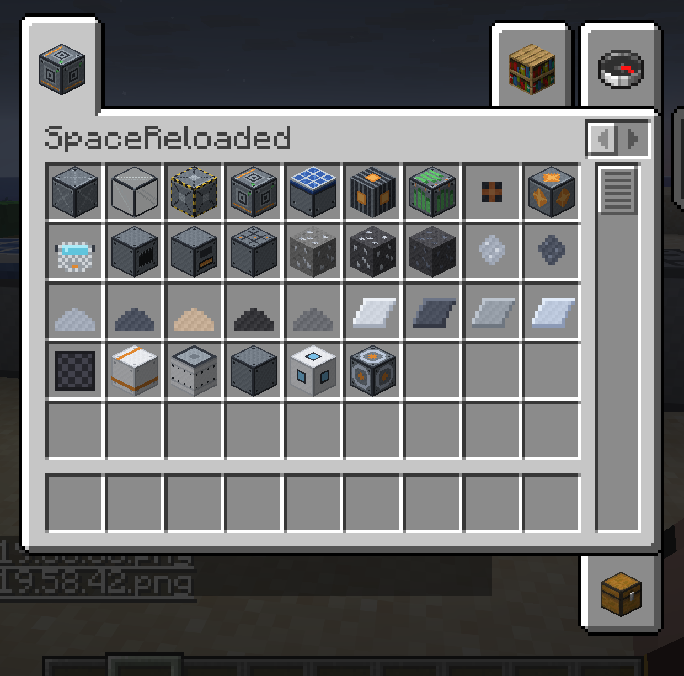
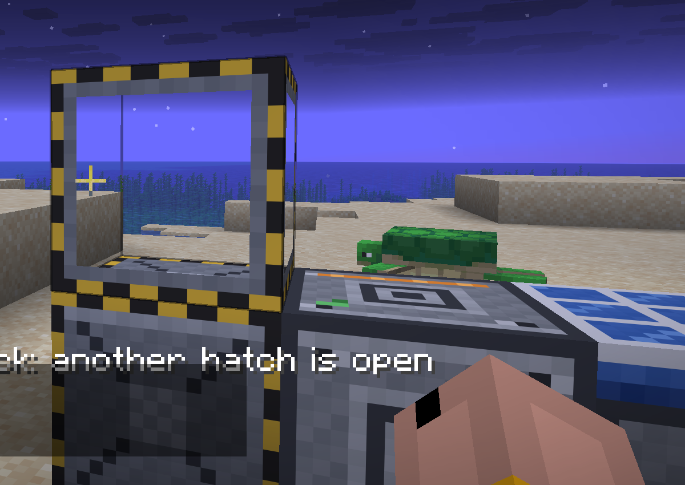

# SpaceReloaded

[](https://github.com/AlexMelanFromRingo/SpaceReloaded/actions/workflows/build.yml)


[](LICENSE)

Космос для Minecraft 26.2 с одним правилом: **физика настоящая**. Ракета
собирается в сущность из блоков, которые вы поставили сами. Запас скорости
считается по формуле Циолковского, тяговооружённость по реальным массам
деталей, а кривая ракета опрокидывается на взлёте.

[English documentation](README.md)

<p align="center">
  
  
</p>

## Что внутри

- **Ракеты произвольной формы.** Стройте что угодно на стартовой площадке,
  Sneak+ПКМ по пилону, и конструкция взлетает единой сущностью. Масса, тяга,
  центр масс и моменты берутся из реальных блоков. TWR меньше единицы
  остаётся на земле. Топливо тратится из тех баков, которые вы залили.
  Обычный клик по пилону даёт скан-отчёт до сборки: запас скорости, TWR
  и вердикт, хватит ли до орбиты.
- **Два топлива с разными характерами.** Керолокс (плотный, тяговитый)
  перегоняется из нефтеносного сланца; гидролокс (высокий удельный импульс)
  получается электролизом льда. Двигатель жжёт один тип, смешанный стек
  не соберётся.
- **Герметичность, которая уважает геометрию.** Проверка помещения идёт
  заливкой в 26 направлениях: диагональная щель в углу считается утечкой,
  ровно как недостроенная рамка портала. Шлюзы с интерлоком. Пробоина
  вызывает декомпрессию, тянущую к дыре.
- **Орбита Земли и Луна.** Измерения с масштабом координат 1:8, орбитальная
  платформа над точкой старта, ISRU на Луне: лёд превращается в гидролокс
  и кислород для баллонов.
- **Стыковка.** Блок «стыковочный узел» задаёт плоскость разделения:
  расстыковали припаркованный стек на носитель и лендер, слетали вниз,
  заправились, вернулись, состыковались. Захват в радиусе 3 блоков,
  парковаться пиксель-в-пиксель не нужно. Топливо делится и суммируется
  по реальной ёмкости баков.
- **Беспилотные рейсы.** Полётная программа (цель плюс посадочный маяк)
  загружается в припаркованную ракету, запуск дистанционный. Автопилот
  набирает высоту, выполняет переход и садится на маяк тормозным импульсом.
- **Орбитальная кинетическая бомбардировка.** Пушка работает только на
  орбите и стреляет вольфрамовыми ломами по честной траектории входа.
  Радиус кратера считается из E = ½mv² с кубическим подобием; обсидиан
  и вода держат удар. Наведение и выстрел дистанционно, пультом из любого
  измерения.
- **Энергетика.** Единицы Team Reborn Energy: угольный генератор на старте,
  солнечные панели (x1.5 в вакууме), РИТЭГи для теневой стороны, кабельные
  сети, аккумуляторы.
- **Ведущая нить.** Шестнадцать достижений ведут от первого стального
  слитка до замкнутой межпланетной петли.

## Никакой телепорт-магии

Ракета не превращается в предмет в инвентаре. Вернуться домой можно тремя
путями: заправиться через ISRU, состыковаться с носителем или построить
титановую возвратную капсулу, выдерживающую посадку до 25 м/с.
Межпространственные события (кинетические удары, беспилотные рейсы) держат
чанки само-протухающими ticket'ами: полёт завершится даже без игроков рядом
и переживёт перезапуск сервера.

## Документация

- [Игровой гайд](docs/GUIDE.ru.md): управление, заправка, кислород,
  стыковка, беспилотные рейсы, пушка.
- [Книга рецептов](https://alexmelanfromringo.github.io/SpaceReloaded/recipes.html):
  все рецепты карточками, от дробления до сборочного стола.
- [Хронология развития](specs/001-space-mod-core/progression.md): полная
  дуга от железа до замкнутой межпланетной петли.
- [Проектные документы](specs/001-space-mod-core/): спецификация, план,
  модель данных, шпаргалка по внутренностям Minecraft 26.2 и
  [backlog](specs/001-space-mod-core/inspiration-backlog.md) механик,
  адаптированных из Advanced Rocketry и Galacticraft.

## Сборка из исходников

Нужен JDK 25 (Temurin).

```bash
./gradlew build                     # всё плюс юнит-тесты
./gradlew :core:test                # тесты физического ядра, без Minecraft
./gradlew :mod:runClientGametest    # E2E-стенд: реальный клиент, 6 сценариев, ~60 с
./gradlew :mod:runClient            # дев-клиент
```

Jar появляется в `mod/build/libs/`.

## Архитектура

- `core/`: чистая Java-физика. Заливка, калькулятор Циолковского и TWR,
  интегратор полёта с гиро-компенсацией, баллистика. Ни одного импорта
  Minecraft, покрыто юнит-тестами.
- `mod/`: слой Fabric. Сущности, станки, измерения, сеть. Детали, топлива
  и планеты заданы datapack-реестрами, поэтому аддон может добавить планету
  или двигатель одним JSON.
- Сервер авторитетен везде. Пересчёт герметичности идёт в фоновых потоках
  по палитровым снимкам, снятым в главном потоке.
- E2E-стенд (`mod/src/gametest/`) поднимает настоящий клиент и на каждое
  изменение прогоняет герметичность, промышленность, сборку,
  межпространственную бомбардировку, стыковку и полётные программы.

## Лицензия

[MIT](LICENSE).
